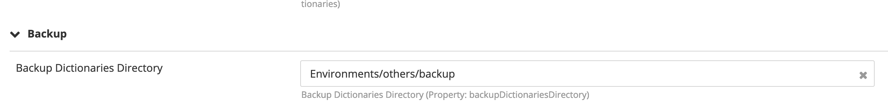
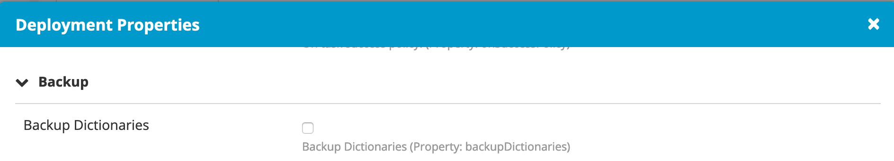
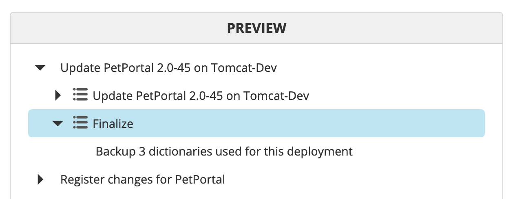
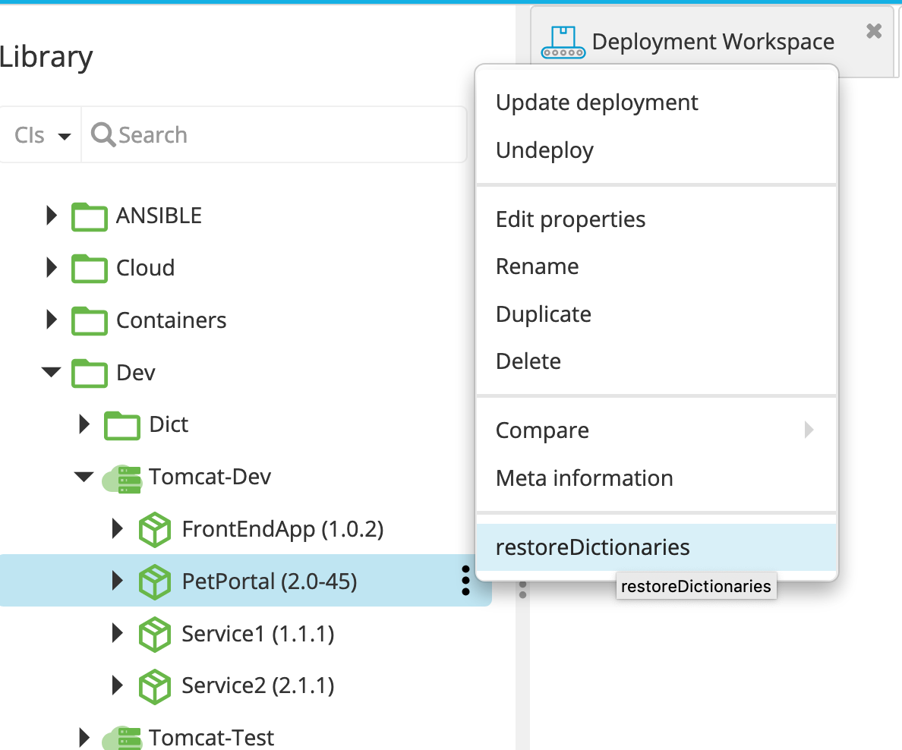
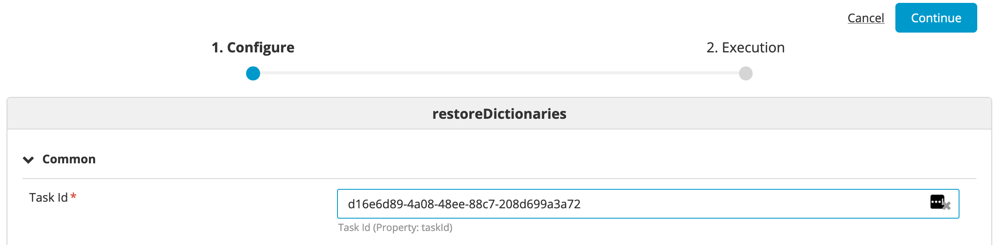

# XL Deploy Backup Dictionary plugin v1.0.0

[![Build Status][xld-backup-dictionaries-plugin-travis-image]][xld-backup-dictionaries-plugin-travis-url]
[![License: MIT][xld-backup-dictionaries-plugin-license-image]][xld-backup-dictionaries-plugin-license-url]
![Github All Releases][xld-backup-dictionaries-plugin-downloads-image]

[xld-backup-dictionaries-plugin-travis-image]: https://travis-ci.org/xebialabs-community/xld-backup-dictionaries-plugin.svg?branch=master
[xld-backup-dictionaries-plugin-travis-url]: https://travis-ci.org/xebialabs-community/xld-backup-dictionaries-plugin
[xld-backup-dictionaries-plugin-license-image]: https://img.shields.io/badge/License-MIT-yellow.svg
[xld-backup-dictionaries-plugin-license-url]: https://opensource.org/licenses/MIT
[xld-backup-dictionaries-plugin-downloads-image]: https://img.shields.io/github/downloads/xebialabs-community/xld-backup-dictionaries-plugin/total.svg

## Preface

This plugin allows to take a snapshopt of the current state of the dictionaries associated to the current environment. A control task allows to reapply the configuration of a previous deployment using the deployment task id.

## Overview
At deployment time, an extra step is generated in the post plan to back up the dictionaries.
A control task is now available on the deployed application to restore the dictionaries by providing the taskid the deployment used at the time. The taskid can be copied from the deployment report (in the detail of the executed task.)

## Requirements

Note:  XLD version should not be lower than lowest supported version.  See <https://support.xebialabs.com/hc/en-us/articles/115003299946-Supported-XebiaLabs-product-versions>.

## Installation

* Copy the latest XLD file from the [releases page](https://github.com/xebialabs-community/xld-backup-dictionaries-plugin/releases) into the `XL_DEPLOY/plugins` directory.
* Restart the XL Deploy server.

## Features
### Environment

### Deployed Application

### Deployment task

### Control Task

